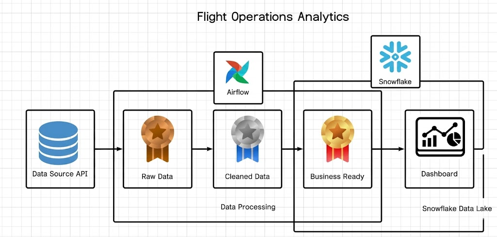

# flight-airflow

```text
flight-airflow/
|----dags/
|     |---flight_pipeline.py
|
|----script/
|     |---bronze_ingest.py
|     |---silver_transform.py
|     |---gold_aggregate.py
|
|----sql/
|     |---create_table.sql
|
|----data/
|     |---bronze/
|     |---silver/
|     |---gold/
|
|----docker-compose.yml
|
|----requirements.txt
|
```
